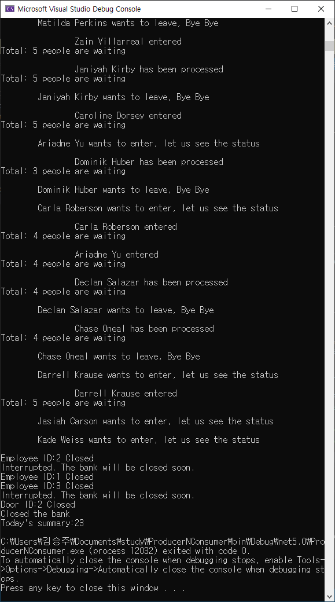

# Producer and Consumer Program

## A bank system, which is implemented as a model of producer and consumer.

In our daily life in a bank, several clients come into the bank, wait for the line,  
and then one of several employees takes the order, then finally clients who finished their business leave the bank.

In this case, clients keep entering, and employees keep working asynchonously. Clients cannot come into a bank but have to wait for the line  
unless the waiting line is empty. Similarly, employees cannot provide any services but have to wait for clients unless there is any client.  
Such a model, where tasks are processed asynchronously, is known as producer and consumer problem, or bounded queue problem.

In this project, I implemented the producer and consumer model, simulating a bank system.





### Using Condition Variable
- waitingLineCV

```cs
public bool add(string name)
{
    //// if queue is full, wait for the queue not full
    if (Interlocked.Read(ref cnt) == capacity)
        notFull.WaitOne();

    // add p to Queue
    try
    {   
        line.Enqueue(name);
        Interlocked.Increment(ref cnt);
    }
    catch (Exception e)
    {
        Console.WriteLine("Interrupted. The bank will be closed soon.");
        return false;
    }

    Console.WriteLine($"{name} entered");
    Console.WriteLine($"Total: {cnt} people are waiting\n");

    // if its not empty
    if (Interlocked.Read(ref cnt) == 1)
        WaitHandle.SignalAndWait(notEmpty, clear2);

    clear1.Set();

    return true;
}

public bool take(out string name)
{
    // if queue is empty, wait for the queue not empty
    if (Interlocked.Read(ref cnt) == 0)
        notEmpty.WaitOne();

    // Remove
    try
    {
        if (line.TryDequeue(out name))
            Interlocked.Decrement(ref cnt);
        else name = "unknown";
    }
    catch (Exception e)
    {
        Console.WriteLine("Interrupted. The bank will be closed soon.");
        name = "unknown";
        return false;
    }
    Console.WriteLine($"{name} has been processed");
    Console.WriteLine($"Total: {cnt} people are waiting\n");
                
    if (Interlocked.Read(ref cnt) == capacity - 1)
        WaitHandle.SignalAndWait(notFull, clear1);

    clear2.Set();

    return true;
}
```

### Using Blocking Collection
- waitingLineBC
```cs
public bool add(string name)
{
    // add p to Queue
    try
    {
        line.Add(name);
        Interlocked.Increment(ref cnt);
    }
    catch (Exception e)
    {
        Console.WriteLine("Interrupted. The bank will be closed soon.");
        return false;
    }

    Console.WriteLine($"\t\t{name} entered");
    Console.WriteLine($"Total: {cnt} people are waiting\n");

    return true;
}

public bool take(out string name)
{
    // Remove
    try
    {
        name = line.Take();
        Interlocked.Decrement(ref cnt);   
    }
    catch (Exception e)
    {
        Console.WriteLine("Interrupted. The bank will be closed soon.");
        name = "unknown";
        return false;
    }
    Console.WriteLine($"\t\t{name} has been processed");
    Console.WriteLine($"Total: {cnt} people are waiting\n");
    return true;
}
```


# Test
- Thread ratio 1:1 , waitingLineCapacity = 5
- Thread ratio 1:3 , waitingLineCapacity = 5
- Thread ratio 3:1 , waitingLineCapacity = 5
- Thread ratio 3:3 , waitingLineCapacity = 5
- Gracefully exiting.

# License
Jiyoung Shin